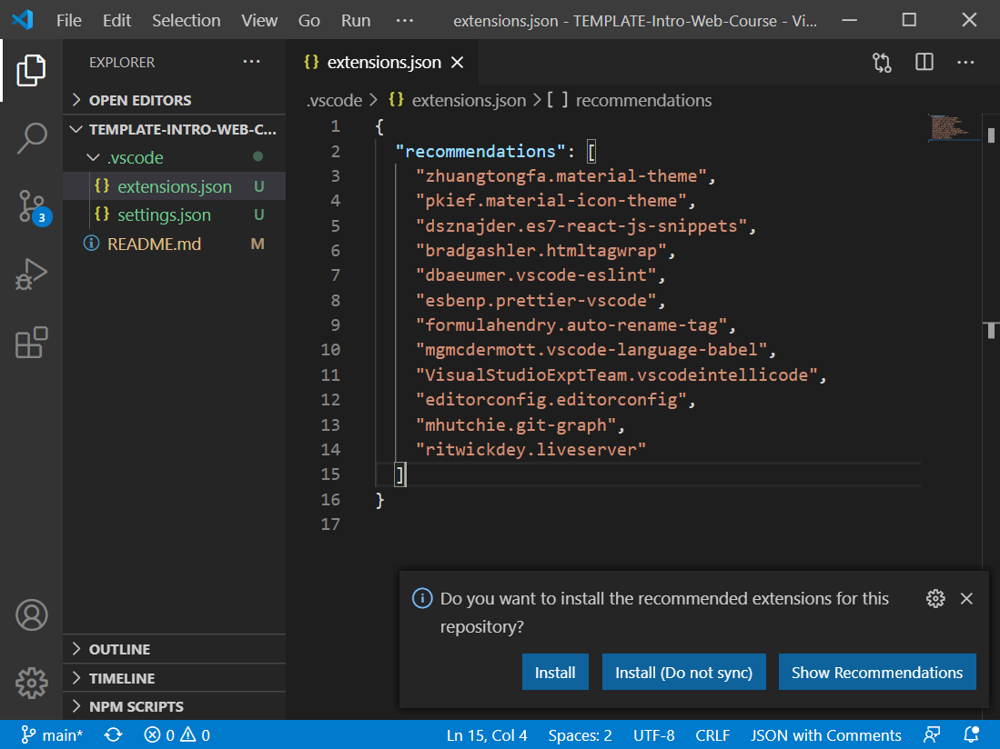

# Introductory course - Getting to know eachother, setup and basic workflow

Here you will learn all the basics to get you started with the web course.

## Steps

1. Install all necessary software:

   - (Visual Studio Code)[https://code.visualstudio.com/]
   - (Git)[https://git-scm.com/]
   - (Cmder)[https://github.com/cmderdev/cmder/releases/download/v1.3.17/cmder_mini.zip]

2. Let's get this repo to play around with it

   - Clone this repo:
     - Create a folder in the root of your drive, call it something short like `siit`, e.g. `C:/siit`
     - Click the green button in github
        "Clone Repo")
     - Copy the URL `CTRL+C`
     - Open cmder and type the following:
     - `cd C:/siit` (Navigate to the newly created folder)
     - `git clone paste_your_url_here_(CTRL-V)` (actually clone the repo)
     - `ls -al` (list all files and folders in the current folder)
     - `cd name_of_the_newly_created_folder` (navigate to the newly created folder (just cloned, is named like the repo))
     - `code .` (open Visual Studio Code to the current folder )

3. Install the recommended plugins
   - just click the `Install` button on the message in the bottom right of Visual Studio Code
     

## Keyboard shortcut cheatsheet

1. Copy: `CTRL-C`
2. Paste: `CTRL-V`
3. Undo: `CTRL-Z`
4. Redo: `CTRL-SHIFT-Z` sometimes `CTRL-Y`
5. Save: `CTRL-S`
6. Open new tab in browser: `CTRL-T`
7. Reopen last closed tab in browser: `CTRL-SHIFT-T`
8. Open dev tools in browser: `CTRL-SHIFT-I` or `F12`

## Command line cheatsheet

1. Navigate: `cd <path>`
   - `<path>` can be any valid path
   - `<path>` can be autocompleted by typing a few letters and then hitting `TAB` on the keyboard
2. Change drive letter: `D:`, `C:`, `E:`
3. List contents of folder: `ls`, `dir`
4. Clear the console: `clear` or hit `CTRL-L`
5. Stop currently executing program: hit `CTRL-C`
6. Close current REPL (Read Eval Print Loop, an application that lets you type inside it) or the console itself: hit `CTRL-D` or type `exit`

## Git Cheatsheet

### Homework workflow

1. Click the URL of the homework assignment
2. GitHub will create a repo for you and give you the URL, you can copy it here, directly
3. Clone the repo as above, copy the URL from GitHub, in cmder navigate to `C:/siit` and type `git clone <paste-the-url>`
4. `git switch -c work` (create a new branch you will work on and switch to it immediately)
5. `git push -u origin work` (sync the new branch to the remote)
6. Do your stuff, work like crazy (in VS Code :))

Do the following as often as possible, preferably every time before you take a break:

1. `git add .`
2. `git commit -m "Describe your work in a short sentence."`

Do the following at least every day, you can do it as often as the above two points:

1. `git push`

When your homework is done, open a pull request:

1. Go to GitHub, find the repo you were
2. Click `Pull Requests`
3.
4. alt ceva
